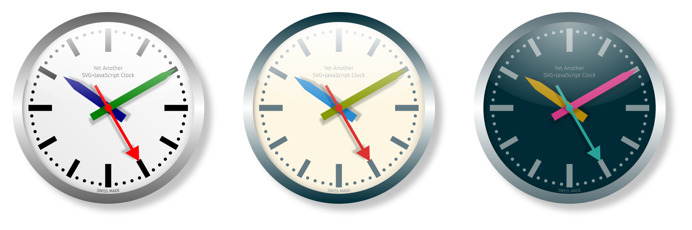

# YA-SVG-JS-C
## Yet Another SVG+JavaScript Clock

<https://fabienfellay.github.io/YA-SVG-JS-C/>

### Description
---
The files [YA_SVG_JS_C.svg](./modular/YA_SVG_JS_C.svg), [YA_SVG_JS_C_SL.svg](./modular/YA_SVG_JS_C_SL.svg)
and [YA_SVG_JS_C_SD.svg](./modular/YA_SVG_JS_C_SD.svg) are some interactive SVG live clocks inspired
(though different) by the Swiss Railway (**SBB CFF FFS**) iconic station clock by Hans Hilfiker. 
See <https://www.sbb.ch/>.

Those documents also feature vectorized portions of the free and open source font **Fira Sans**
(light weight used). 
See <https://bboxtype.com/typefaces/FiraSans/>.

In its first original version, the hand colors are chosen according the the RGB canonical color scheme.
It is a mnemonic: Red for seconds, Green for minutes and Blue for hours. Then, **Solarized-theme**
light and dark versions were created in addition. 
See <https://ethanschoonover.com/solarized/>

A JavaScript dynamical simulation (file [engine_script.js](./modular/engine_script.js)) is running
in order to animate the clock hands. **Click** on the hands to perturb them. **Ctrl+click** changes
the direction of the perturbation. **Shift+click** increases the perturbation impulse amplitude.
**Ctrl** and **Shift** can be combined. Files [options_continuous.js](./modular/options_continuous.js)
and [options_stepping.js](./modular/options_stepping.js) are parameters files storing information
about different dynamics behaviors.

Note that the script [engine_script.js](./modular/engine_script.js) on which the dynamical simulation
is based uses **Math.js**, mainly because of various matrix operations not natively available with
JavaScript (file [math.js](./modular/math.js)). 
See <https://mathjs.org/>

The SVG artworks themselves were designed using the free and open source vector graphics editor
**Inkscape**. 
See <https://inkscape.org/>

### Interactive clocks
---
***Original (YA-SVG-JS-C)***

<https://fabienfellay.github.io/YA-SVG-JS-C/modular/YA_SVG_JS_C.svg>

  <object data="https://fabienfellay.github.io/YA-SVG-JS-C/modular/YA_SVG_JS_C.svg"
     height="650" width="650" type="image/svg+xml">
  </object>

***Solarized Light (YA-SVG-JS-C-SL)***

<https://fabienfellay.github.io/YA-SVG-JS-C/modular/YA_SVG_JS_C_SL.svg>

  <object data="https://fabienfellay.github.io/YA-SVG-JS-C/modular/YA_SVG_JS_C_SL.svg"
     height="650" width="650" type="image/svg+xml">
  </object>

***Solarized Dark (YA-SVG-JS-C-SD)***

<https://fabienfellay.github.io/YA-SVG-JS-C/modular/YA_SVG_JS_C_SD.svg>

  <object data="https://fabienfellay.github.io/YA-SVG-JS-C/modular/YA_SVG_JS_C_SD.svg"
     height="650" width="650" type="image/svg+xml">
  </object>

### How to use
---
First, download the following common files (right-click and _save as_ is OK):

- [math.js](./modular/math.js) 
- [engine_script.js](./modular/engine_script.js)

Then, for the original and Solarized Light versions, download files (a continuous sweeping dynamic
has been chosen for those versions):

- [options_continuous.js](./modular/options_continuous.js) 
- [YA_SVG_JS_C.svg](./modular/YA_SVG_JS_C.svg) 
- [YA_SVG_JS_C_SL.svg](./modular/YA_SVG_JS_C_SL.svg)

Finally, assuming all the later files are in the same folder, simply open the SVG files directly
with a modern browser (Firefox, Chrome, ...) and the interactive clocks should be displayed and
running fine.

For the Solarized Dark version, the same principle applies but use the following files instead
(a stepping dynamic has been chosen for this version):

- [options_stepping.js](./modular/options_stepping.js) 
- [YA_SVG_JS_C_SD.svg](./modular/YA_SVG_JS_C_SD.svg)

In addition, the following simple html files are only provided as examples on how to embed the
interactive SVG clocks directly in some html pages:

- [YA_SVG_JS_C.html](./modular/YA_SVG_JS_C.html) 
- [YA_SVG_JS_C_SL.html](./modular/YA_SVG_JS_C_SL.html) 
- [YA_SVG_JS_C_SD.html](./modular/YA_SVG_JS_C_SD.html) 
- [YA_SVG_JS_C_SLD.html](./modular/YA_SVG_JS_C_SLD.html)

Finally, for those who like all-in-one files, standalone versions are now available.
All the needed scripts are embedded in single SVG files. Those are all you'll need to
have running interactive clocks:

- [YA_SVG_JS_C_Standalone.svg](./standalone/YA_SVG_JS_C_Standalone.svg) 
- [YA_SVG_JS_C_SL_Standalone.svg](./standalone/YA_SVG_JS_C_SL_Standalone.svg) 
- [YA_SVG_JS_C_SD_Standalone.svg](./standalone/YA_SVG_JS_C_SD_Standalone.svg)

### History
---
- 21.05.2021: Update **Math.js**.

- 11.11.2019: Provide standalone files, automatically generated by a Python script.

- 28.10.2019: Small Design Tweak (centering of the 'SWISS MADE' seal, correct artwork title
  'JavaScript' with a capital S). Typos corrected in the engine script and adaptation to the
  latest **Math.js** version. **Solarized-theme** versions introduced. Define separate options
  files for different dynamics. Modify SVG dimensions to % unit and add the viewbox property in
  order to allow re-scalable svg (with active script) in html. Migration to **GitHub**.

- 06.10.2017: Design Update (the initial version was identical to the **SBB CFF FFS** clock,
  leading to potential copyright issues).

- 04.10.2017: Initial Design.

Old version website: 
[https://inkscape.org/en/~fabien.fellay/★yet-another-svgjavascript-clock](https://inkscape.org/~fabien.fellay/%E2%98%85yet-another-svgjavascript-clock)

---
*Copyright &copy; 2017-2021 Fabien Fellay.*

The script [engine_script.js](./modular/engine_script.js) along with its parameters files
[options_continuous.js](./modular/options_continuous.js) and
[options_stepping.js](./modular/options_stepping.js) are licensed under the
GNU General Public License version 3 (GPL-3.0). 
<https://opensource.org/licenses/GPL-3.0> 
<https://www.gnu.org/licenses/>

The SVG artworks are licensed under the Creative Commons Attribution-ShareAlike 4.0 International
(CC BY-SA 4.0). 
<https://creativecommons.org/licenses/by-sa/4.0/>

The math.js library is licensed under the Apache License 2.0. 
<https://www.apache.org/licenses/>
