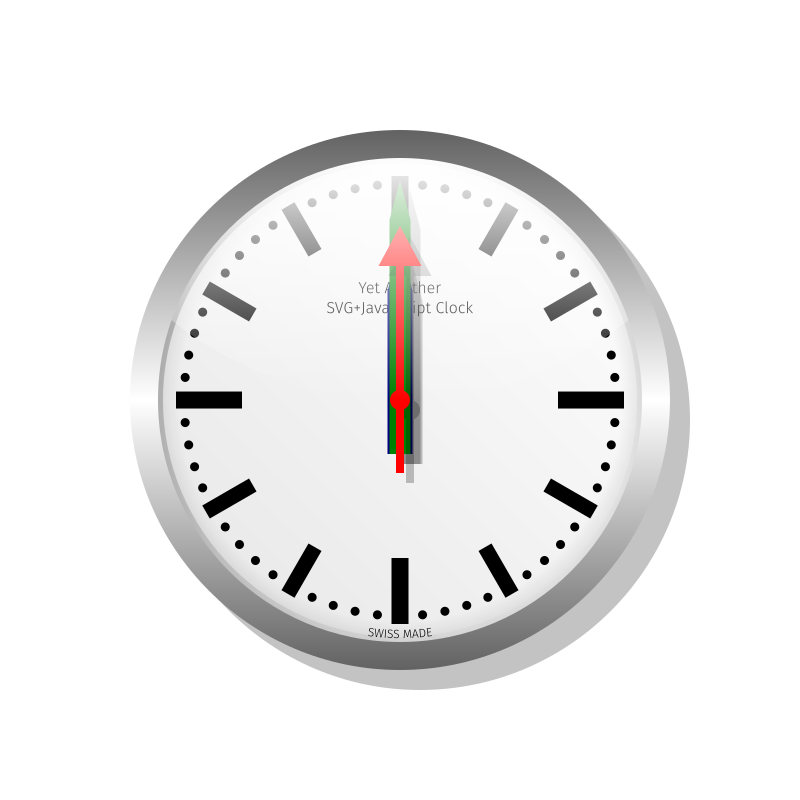
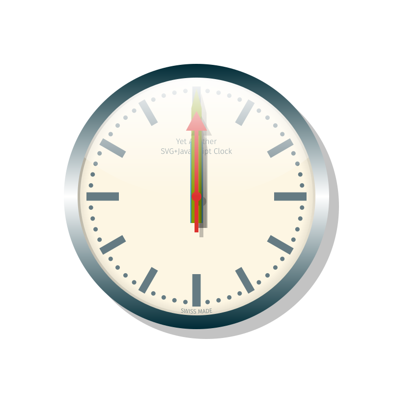
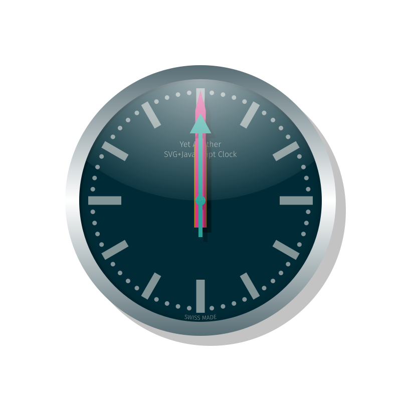

# YA-SVG-JS-C
## Yet Another SVG+Javascript Clock

This interactive document is a SVG live clock inspired (though different) by the Swiss Railway (**SBB CFF FFS**) iconic station clock by Hans Hilfiker. See <https://www.sbb.ch/>.

The document also features vectorized portions of the free and open source font **Fira Sans** (light weight used). See <https://bboxtype.com/typefaces/FiraSans/>.

In its first original version, the hand colors are chosen according the the RGB canonical color scheme. It is a mnemonic: Red for seconds, Green for minutes and Blue for hours. Then, **Solarized-theme** light and dark versions were created. See <https://ethanschoonover.com/solarized/>

A javascript dynamical simulation is running in order to animate the clock hands. **Click** on the hands to perturb them. **Ctrl+click** changes the direction of the perturbation. **Shift+click** increases the perturbation impulse amplitude. **Ctrl** and **Shift** can be combined.

The script **engine_script.js** on which the dynamical simulation is based uses **Math.js** (version 6.2.3): <http://mathjs.org/>

***Original (YA-SVG-JS-C)***

***Solarized Light (YA-SVG-JS-C-SL)***

***Solarized Dark (YA-SVG-JS-C-SD)***

04.10.2017: Initial Design

06.10.2017: Design Update (the initial version was identical to the **SBB CFF FFS** clock, leading to potential copyright issues)

02.10.2019: Small Design Tweak (centering of the 'SWISS MADE' seal). Typos corrected in the engine script and adaptation to the latest **math.js** version. **Solarized-theme** versions introduced. Migration to **GitHub**.

Copyright (C) 2017-2019 by Fabien Fellay

The script **engine_script.js** is licensed under the GNU General Public License version 3 (GPL-3.0).
<https://opensource.org/licenses/GPL-3.0>
<https://www.gnu.org/licenses/>

The SVG artworks are licensed under the Creative Commons Attribution-ShareAlike 4.0 International (CC BY-SA 4.0).
<https://creativecommons.org/licenses/by-sa/4.0/>

The math.js library is licensed under the Apache License 2.0.
<https://www.apache.org/licenses/>

Created By Fabien Fellay, 2017-2019
